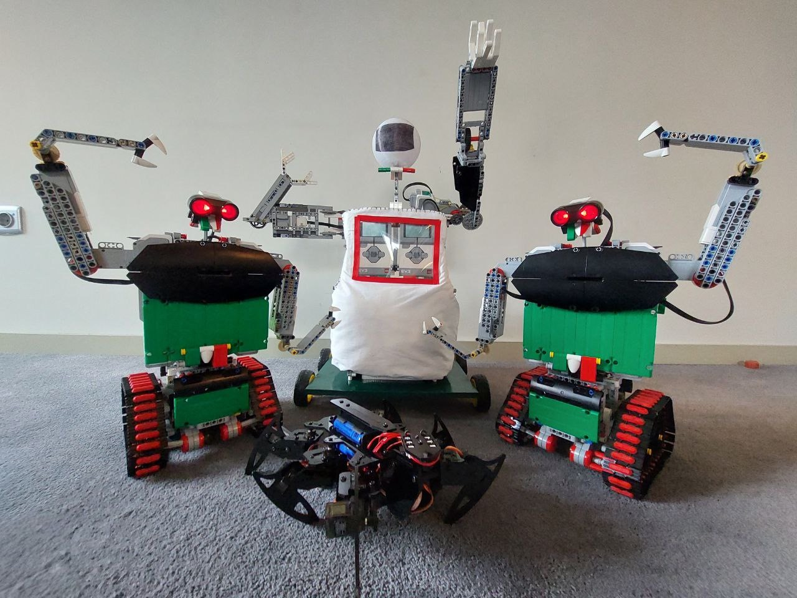
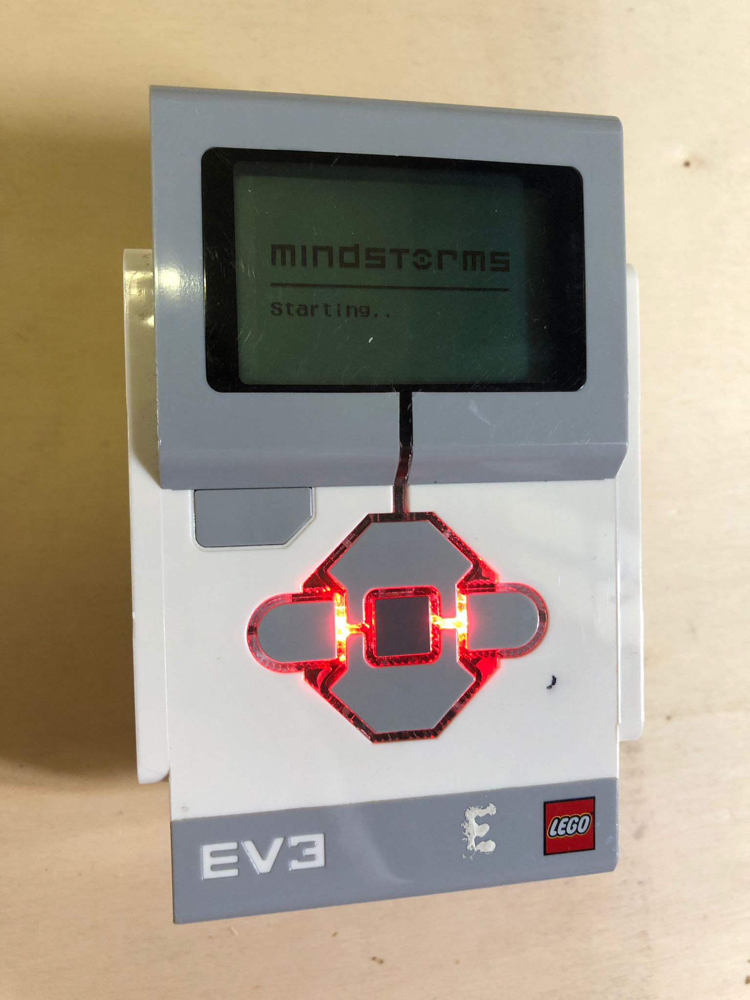

# Dancing in Space
Here, you can see the details of our project for the robocup onstage competition. We have progammed 3 robots (2 smaller and 1 bigger), who dance together.

Our performance is based on 2 pieces of music: "We will rock you" by Queen and "Animals" by Martin Garrix. The 3 robots will execute an engaging choreography, syncronized with each other by  Lego Bluetooth.

We have also added a led strip that will accompany the whole choreography in time with the music. The lights will simulate constellations with a simple switch on-off...  We have therefore attached the LEDs behind a billboard that will be the background to the show. This playbill represents space, full of stars and planets, perfectly made by our artists staff
